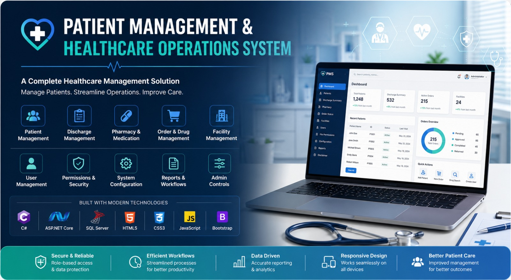

# Patient Management & Healthcare Operations System

A full-stack healthcare management application designed to manage patient information, healthcare workflows, discharge summaries, pharmacy operations, facility management, user administration, permissions, and system configuration.

> **Portfolio Project:** End-to-end application development including UI design, frontend, backend, API integration, and database-driven functionality.

---

## 📌 Project Overview

This application is a healthcare management platform designed to support patient-related operations and administrative workflows.

The system provides dedicated modules for managing patient information, patient load, discharge summaries, pharmacy and medication workflows, facilities, users, permissions, and system configuration.

The application was designed and developed as a full-stack solution with a focus on usability, structured workflows, data management, and a consistent enterprise-style user interface.

---

## 🚀 Key Features

### Patient Management

* Patient profile and information management
* Patient load and patient details
* Patient-related data management
* Healthcare workflow processing

### Discharge Management

* Discharge summary management
* Discharge summary listing
* Detailed discharge information
* Discharge workflow processing

### Pharmacy & Medication Management

* Pharmacy management
* Drug search
* Drug quote management
* Drug return processing
* Order status tracking

### Facility & User Management

* Facility management
* User listing and management
* User creation
* File permission management

### System & Configuration

* Destruction batch management
* Destruction method management
* Destruction reason management
* Page/custom-name configuration
* Disclaimer management
* Application configuration

---

## 🛠️ Technology Stack

### Backend

* ASP.NET Core
* C#
* REST APIs

### Frontend

* HTML5
* CSS3
* JavaScript
* Bootstrap

### Database

* Microsoft SQL Server

### Development Tools

* Visual Studio
* Git
* GitHub

---

## 💻 My Contribution

I was responsible for the **end-to-end development** of this application.

### UI & Frontend

* Designed the application UI and overall interface structure.
* Developed frontend functionality and user interactions.
* Created and customized forms, tables, search interfaces, modals, and management screens.
* Maintained a consistent and user-friendly design across different application modules.
* Implemented responsive and enterprise-style interfaces.

### Backend

* Developed backend functionality using ASP.NET Core and C#.
* Implemented business logic and application workflows.
* Developed and integrated REST APIs.
* Connected frontend functionality with backend services.

### Database & Data Integration

* Worked with Microsoft SQL Server.
* Implemented database-driven application functionality.
* Developed data operations required by different application modules.
* Integrated application workflows with database data.

### Application Development

* Developed healthcare-related business modules.
* Implemented patient, discharge, pharmacy, facility, user, and configuration functionality.
* Developed administrative and permission-related features.
* Tested, debugged, and enhanced application functionality based on requirements.

---

## 📸 Application Screenshots

### Login

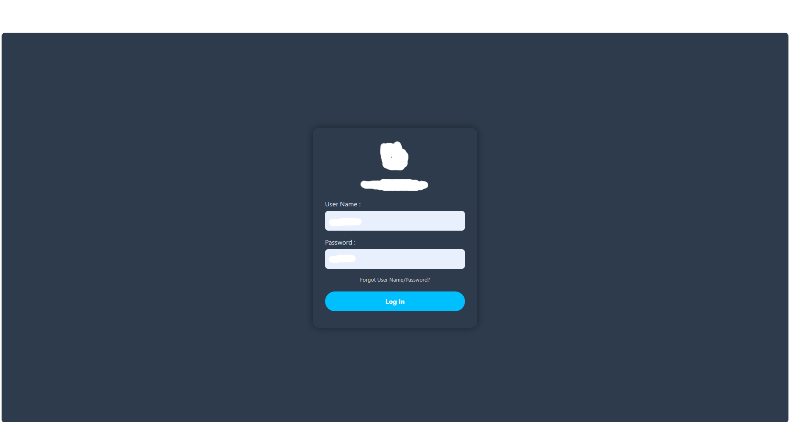

### Patient Profile

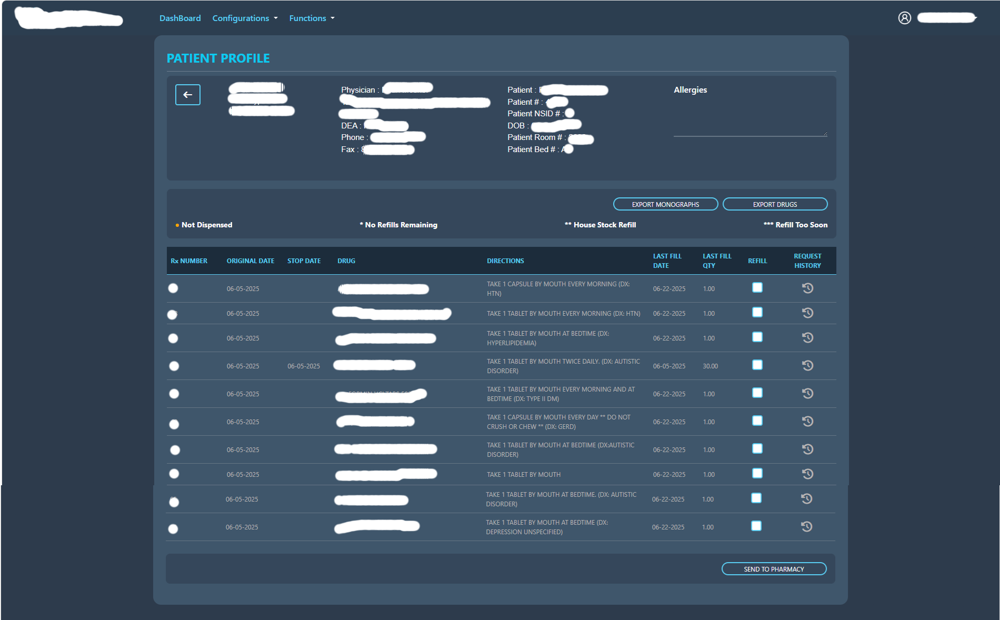

### Patient Load

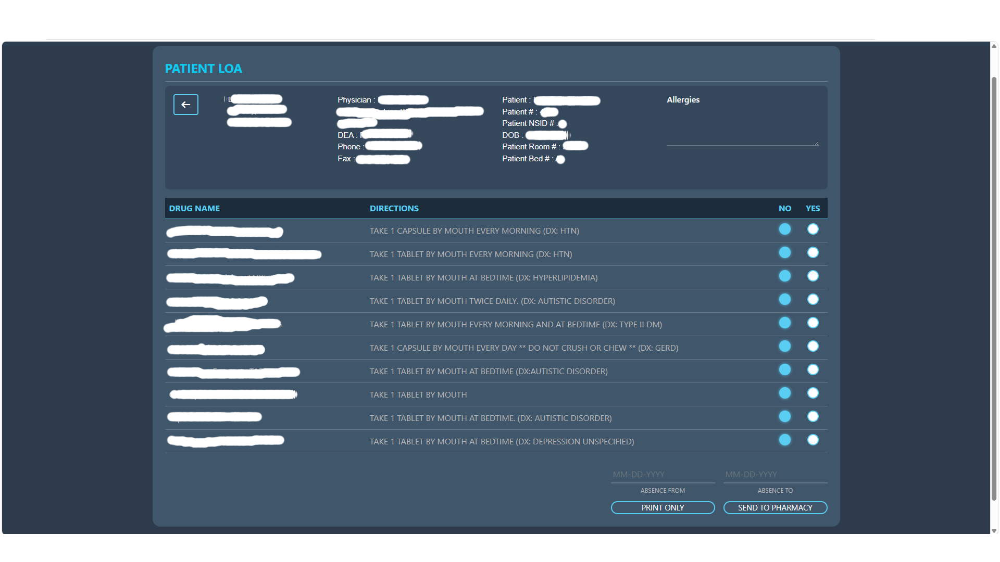

### Discharge Summary List

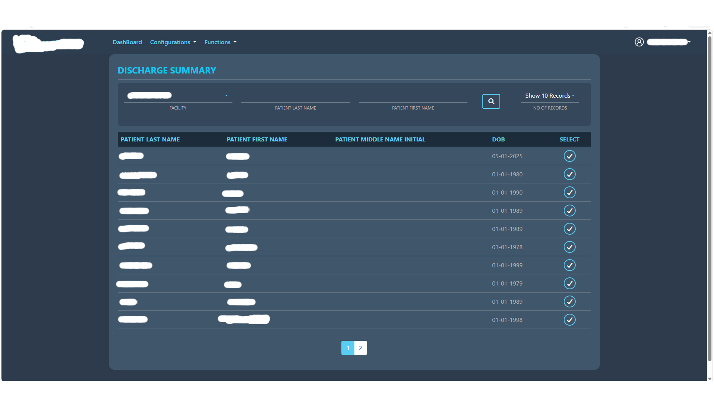

### Discharge Summary Details

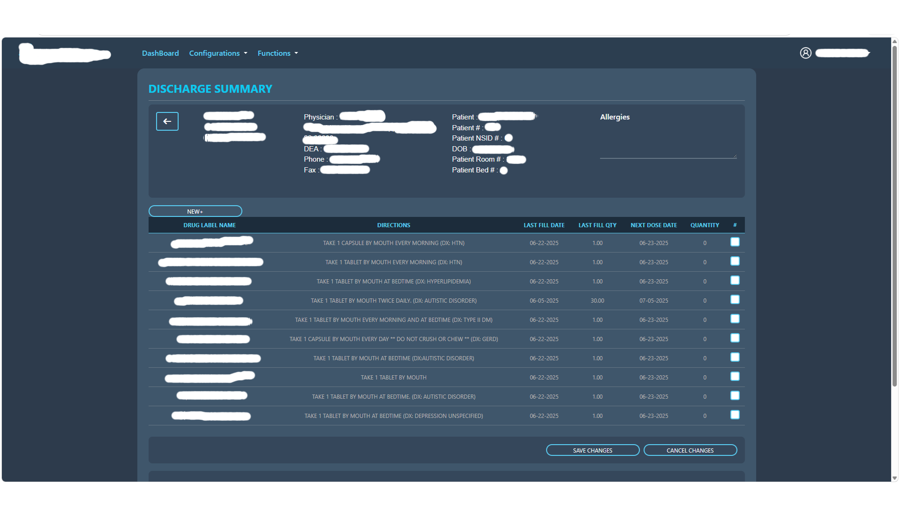

### Pharmacy

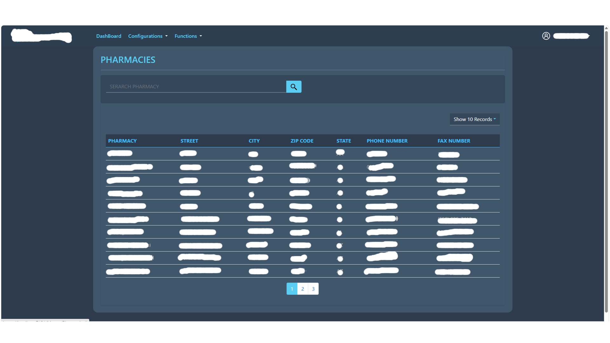

### Drug Search

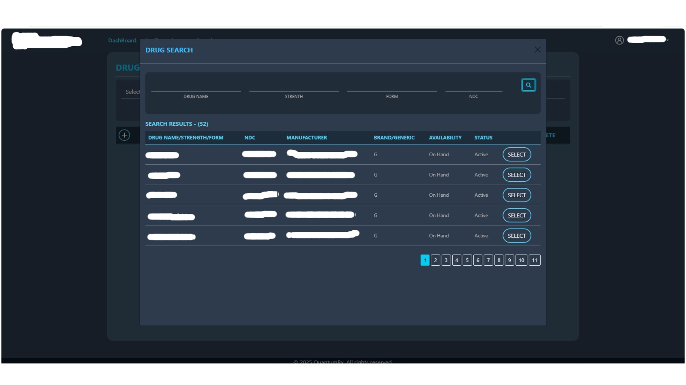

### Drug Quote

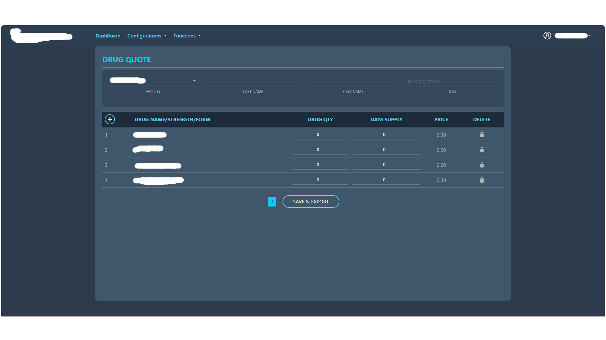

### Drug Return

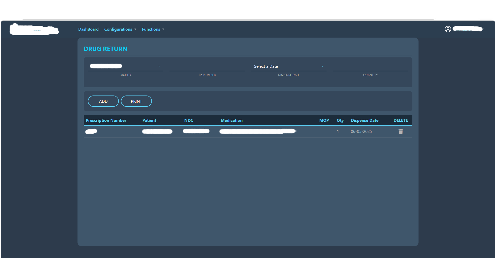

### Order Status

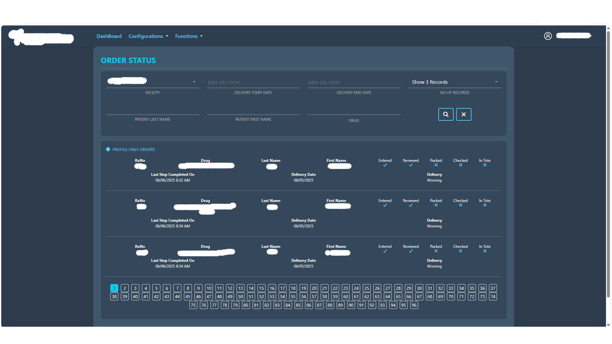

### User List

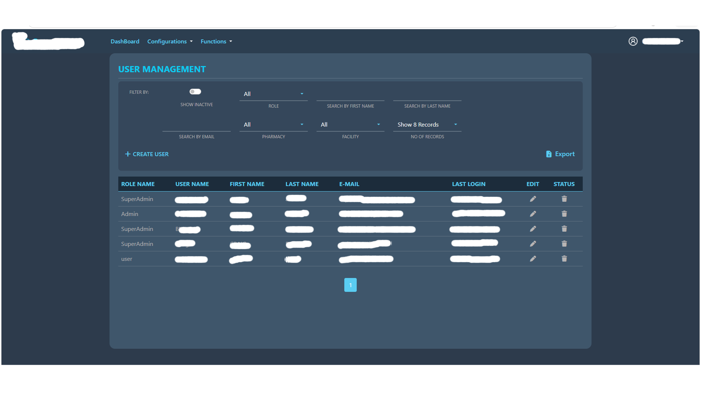

### Create User

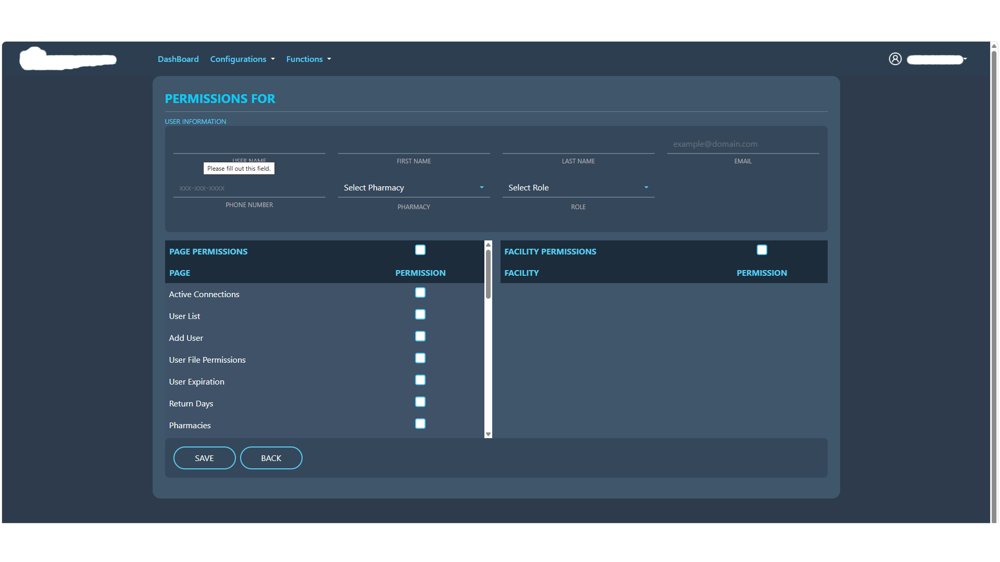

### Facilities

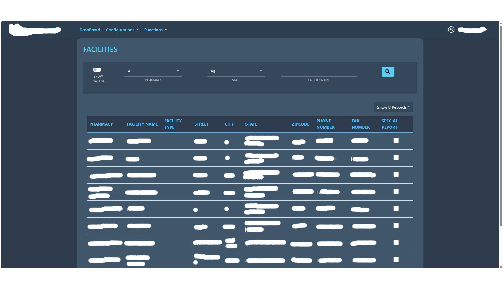

### File Permissions

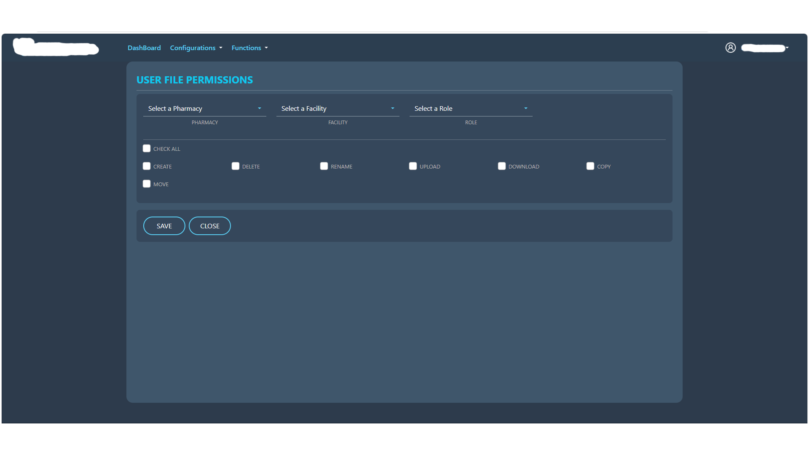

### Destruction Batch

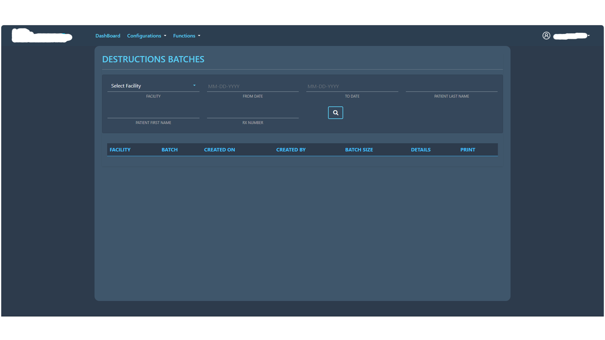

### Destruction Method

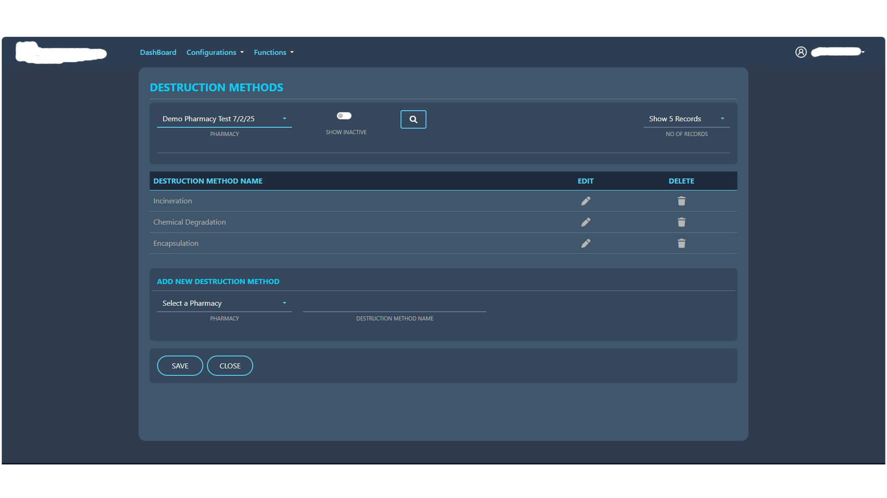

---

## ⭐ Project Highlights

* End-to-end full-stack application development
* Custom UI design and frontend development
* ASP.NET Core backend development
* REST API integration
* SQL Server database integration
* Healthcare workflow management
* Patient and discharge management
* Pharmacy and medication workflows
* Facility and user management
* Permission and configuration management
* Consistent enterprise-style user interface

---

## 🔐 Portfolio Disclaimer

The screenshots included in this repository are for portfolio demonstration purposes only.

Sensitive, confidential, and personally identifiable information has been masked or removed. No production source code, credentials, connection strings, or confidential client data are included in this repository.
